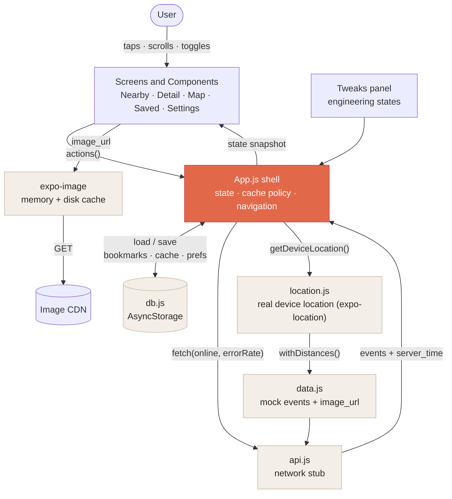
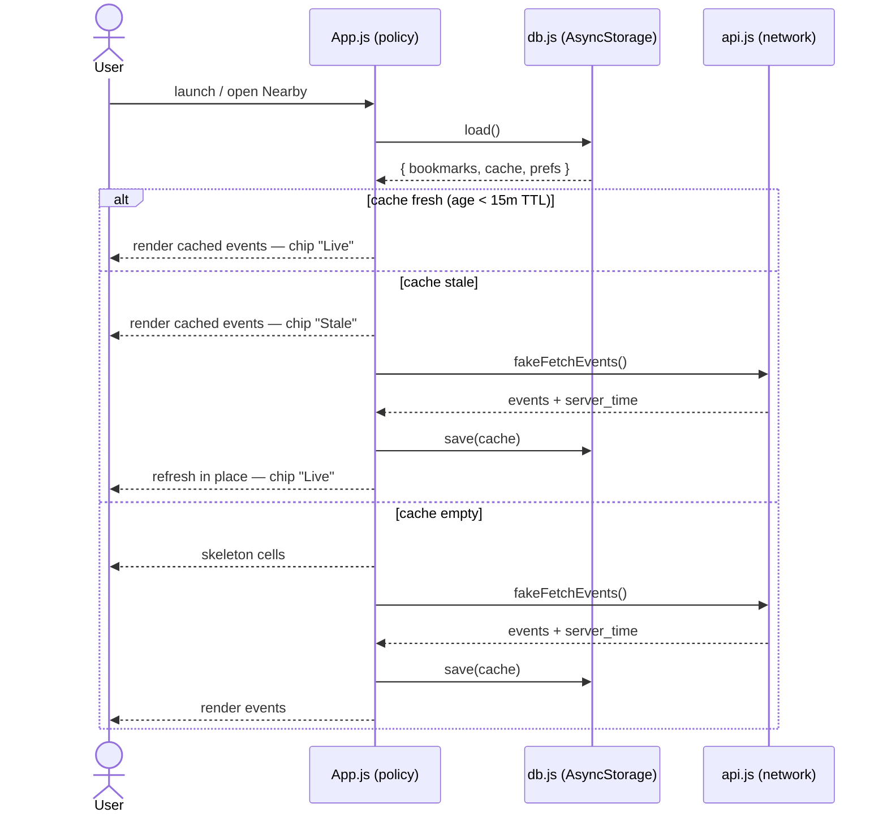
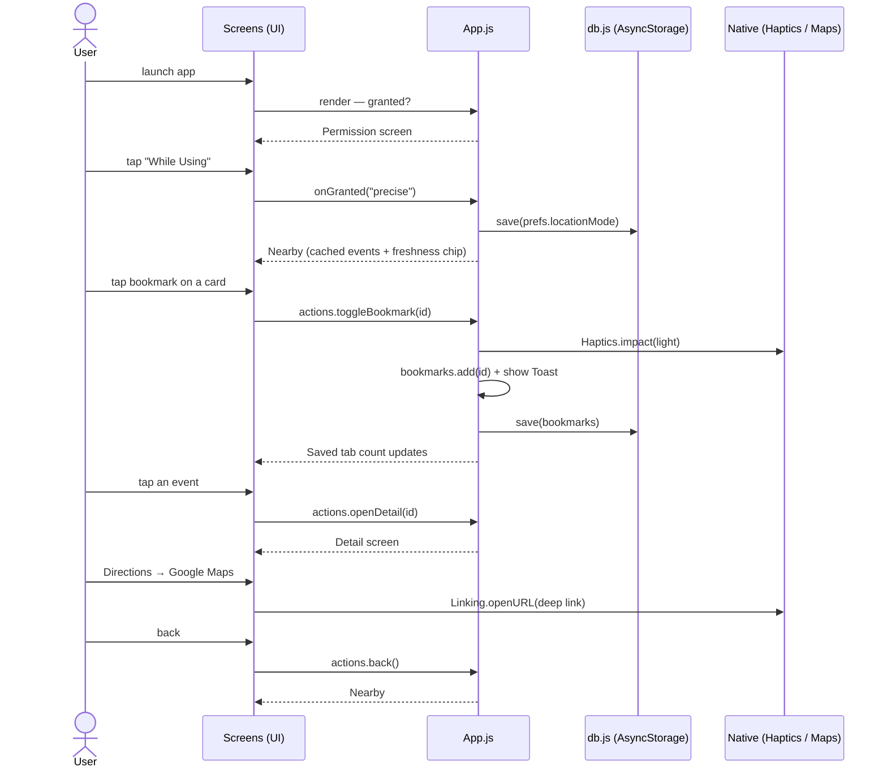

# Architecture — Find Events Near Me

This document explains how the app is put together: its layers, how data flows,
what each file owns, and the key design decisions. It's meant to be enough to walk
someone through the app without reading every line of source.

- **Platform:** React Native via **Expo SDK 54** (React 19.1, RN 0.81). Runs on iOS
  and Android from one JS codebase; previewable in Expo Go.
- **Shape:** a single-page app with state-driven navigation (no router) — five
  destinations plus a modal-style detail view and a first-run permission screen.
- **Origin:** a faithful native port of an HTML/React design prototype that documented
  an iOS/SwiftUI architecture. The JS layers below mirror that architecture; see
  [Mapping to the production iOS app](#mapping-to-the-production-ios-app).

---

## 1. Layered overview

```
┌──────────────────────────────────────────────────────────────────────┐
│  Screens            Nearby · Detail · Map · Saved · Settings ·         │  presentation
│  + Components        Permission · Tweaks   (src/screens, src/components)│
├──────────────────────────────────────────────────────────────────────┤
│  App shell (App.js)  state · navigation · cache policy · tweaks        │  orchestration
│                      (the "view-model / repository" seam)              │
├──────────────────────────────────────────────────────────────────────┤
│  Services            api.js (network stub) · db.js (AsyncStorage) ·    │  I/O
│                      location.js (device location) · data.js (mock)    │
├──────────────────────────────────────────────────────────────────────┤
│  Foundation          theme.js · ThemeContext · oklch.js · icons.js     │  cross-cutting
└──────────────────────────────────────────────────────────────────────┘
```

A screen never talks to a service directly. **`App.js` is the single orchestrator**:
it owns all app state, runs the cache-then-network policy, and passes a read-only
`state` object and an `actions` object down to each screen. Screens are otherwise
presentational.

### Data-flow diagram



The arrows are the actual data paths: user input becomes `actions` on `App.js`;
`App.js` reads/writes the local DB, calls the network stub, asks `location.js` for the
device coordinate (which `data.js` uses to derive each event's distance), and pushes a
read-only `state` snapshot back to the screens. Images flow separately from the cards
straight through `expo-image`'s cache.

---

## 2. Directory map (what owns what)

```
App.js                         App shell: state, navigation, cache, tweaks, fonts
src/
  data.js                      Mock REST payload (the "events DB" seed) + server_time
  db.js                        Persistence: AsyncStorage wrapper (bookmarks + cache + prefs)
  api.js                       fakeFetchEvents network stub + CACHE_TTL_SEC
  location.js                  Real device location (expo-location) + Haversine distance
  theme.js                     AUTO-GENERATED light/dark palettes + type/radius scales
  oklch.js                     Runtime oklch→hex (per-event placeholder hues)
  icons.js                     Stroke icon set (react-native-svg)
  ThemeContext.js              Provides active palette + dark flag to the tree
  components/
    Screen.js                  Standard screen chrome (glow bg + safe-area inset)
    ScreenBackground.js        Radial-glow background (SVG) the glass blurs over
    Glass.js                   Liquid-glass primitive (blur + tint + hairline + shadow)
    GlassButton.js             Circular blurred button (back/share/bookmark/refresh)
    BrandHeader.js / Logo.js   App name + SVG brand mark
    AppHeader.js               Floating header pill: location, freshness chip, refresh
    TabBar.js                  Bottom nav bar — reserves space (Nearby/Map/Saved/Settings)
    EventCard.js               List cell: image, category pill, bookmark, title, meta
    EventImage.js              expo-image over the striped placeholder (load/fallback)
    ImgPlaceholder.js          Striped placeholder + shimmer
    SkeletonCard.js            Cold-start loading cell
    FreshnessChip.js           Live/Stale/Offline + age pill
    IOSSwitch.js               Settings toggle
    Toast.js                   Transient confirmation pill
  screens/
    PermissionScreen.js        First-run primer → real OS location permission prompt
    NearbyScreen.js            Home: brand, header, filter chips, banners, list
    DetailScreen.js            Hero, fact grid, venue card, maps action sheet, CTA
    MapScreen.js               Real map (LeafletMap) + price pins, "you are here", card
    LeafletMap.js (component)  Leaflet/OSM map in a WebView (markers, postMessage)
    SavedScreen.js             Bookmarks list + count chip + empty state
    SettingsScreen.js          Permission/radius/refresh/low-data/cache/notify/diag
    TweaksSheet.js             Developer panel to drive every engineering state
```

---

## 3. State & navigation (App.js)

All state lives in `App.js`'s `Shell` component. There is no Redux/router; navigation
is just state.

**Persistent state** (survives restarts, written to AsyncStorage):
- `bookmarks` — a `Set` of saved event ids.
- `prefs` — `{ lowDataMode, bgRefresh, notify, locationMode, radiusMi }` (`radiusMi`
  is the search radius — default 40, editable in Settings via a validated 1–250 input).
- `cache` — `{ events, fetched_at, v }` (the cached API response, when it landed, and a
  `DATA_VERSION` tag; a persisted cache whose `v` ≠ current is discarded on launch so
  seed-data changes show up without a manual refresh).

**Ephemeral state** (in-memory only):
- `tab` (`nearby|map|saved|settings` — labelled "Search Event / Map / My Events /
  Profile settings" in the bottom bar), `openEventId`, `refreshing`, `fetchError`,
  `now` (ticks every 5s so age chips update), `granted` (permission), `coords` (live
  device location), `toast`, `tweaksOpen`, and `tweaks` (the engineering-state values).

**Derived event lists.** From the cache, `App.js` derives `allEvents` (each event tagged
with its true distance from `coords`, see §6) and `events` = `allEvents` filtered to
within `prefs.radiusMi`. The
discovery surfaces (Search Event / Map) get the radius-filtered `events`; Saved and the
detail view get `allEvents`, so bookmarks and an open event are never hidden by the radius.

**Navigation** is a derived render: permission screen if `!granted`, else the detail
screen if an event is open, else the active `tab`'s screen. The `TabBar` is a flex
sibling below the screen body (it reserves space, so content never sits under it); the
Tweaks gear and `Toast` float just above it. All three are rendered once at the shell.

Two objects flow down to every screen:
- `state` — a read-only snapshot (events, freshness, online, bookmarks, prefs…).
- `actions` — callbacks (`openDetail`, `back`, `refresh`, `toggleBookmark`,
  `clearCache`, `setBgRefresh`, …).

```
            ┌── tweaks (engineering states) ──┐
            ▼                                  │
  ┌───────────────────┐   state   ┌────────────────────┐
  │      App.js       │──────────▶│      Screens       │
  │  (state + policy) │◀──────────│  (presentational)  │
  └─────────┬─────────┘  actions  └────────────────────┘
            │ reads/writes
            ▼
   db.js · api.js · location.js
```

---

## 4. Data & the local "database"

`src/data.js` is the **mock REST payload** — the events the server would return,
each with id, title, category, venue, address, `lat`/`lng`, time, price, capacity,
tags, and an `image_url`. `distance_mi` is **not** stored here — it's computed at
runtime against the live device coordinate by `withDistances` (see §6).

`src/db.js` is the **persistence layer** (the production app's Core Data). It wraps
`@react-native-async-storage/async-storage` with `load()`, `save()`, `clearCache()`,
and `clearAll()`. It stores two logically separate things:
- **bookmarks** — durable user data, never auto-evicted.
- **cache** — the last API response, TTL-bound and safe to discard.

On launch `App.js` hydrates from `db.js`; on any change to bookmarks/cache/prefs it
writes back.

---

## 5. Networking & the cache policy

`src/api.js` exposes `fakeFetchEvents({ online, errorRate })` — a stub that models
700–1100 ms latency, offline failure, and a configurable error rate, returning the
events plus a fresh `server_time`. (In production this is `URLSession`/`fetch` with
ETags.) It also exports `CACHE_TTL_SEC = 15 * 60`.

The cache policy lives in `App.js` and is **stale-while-revalidate**:

```
freshness = (now - cache.fetched_at) < TTL ? "fresh" : "stale"

  fresh   → show cached data, no network
  stale   → show cached data AND refresh in the background
  empty   → fetch; show skeleton cells until data arrives
```



The header **freshness chip** (Live · 2m / Stale / Offline) tells the user which
truth they're seeing. Supporting behaviors, all in `App.js`:
- **Background refresh:** every 30 s while foregrounded, refetches *only* if online
  and stale (≈30 min via `BGAppRefreshTask` in production). Gated by `prefs.bgRefresh`.
- **Reconnect:** coming back online with a stale cache triggers one refresh.
- **Errors never dead-end:** network fail + fresh cache → silent; + stale cache →
  show data + amber banner; + no cache → empty state with retry.

---

## 6. Location & distance

`src/location.js` reads the **real device location** via **`expo-location`**
(`getDeviceLocation()` → `requestForegroundPermissionsAsync()` +
`getCurrentPositionAsync()`; works in Expo Go). On denial/error it falls back to
`DEFAULT_LOCATION` (mode `"city"`) so the app still renders. On the real-location path it
also **reverse-geocodes** the coordinate (`Location.reverseGeocodeAsync`) to a
district-level label (e.g. "Mission, San Francisco") shown in the header; it falls back
to "Current location" when offline/denied or the lookup is empty.

`withDistances(events, coord)` attaches each event's **true distance** from the live
device coordinate to its own location (`haversineMiles` / `distanceTo`), leaving the
event's lat/lng untouched — so the displayed distance reflects where the device actually
is and updates as it moves. `App.js` holds the live `coords` and derives the displayed
events with a `useMemo`. (The sample events have fixed coordinates; a device far from
them simply shows large distances, which the search radius may then filter out.)

`PermissionScreen` is a **primer**: its "Enable location" button calls the injected
`onEnable`, which fires the **real OS permission dialog**; "Use a city instead" takes
the fallback. The resulting mode is stored in `prefs.locationMode` and shown in Settings.

---

## 7. Images

`EventImage` renders an event's `image_url` via **`expo-image`** (built-in
memory + disk cache → the architecture's image-cache layer) with a fade-in
transition. Underneath it always renders `ImgPlaceholder` (a striped, hue-per-event
SVG that shimmers while loading), so the UI never flashes empty and degrades
gracefully if a URL fails. **Low-data mode** (Settings/Tweaks) skips the decode path,
matching "skip images on cellular."

---

## 8. Theming & the visual system

The design is iOS-26 "Liquid Glass." Two pieces make that portable:

- **`theme.js`** is generated by `gen-theme.js` from the design's exact `oklch(...)`
  tokens into RN-friendly hex/rgba — full **light and dark** palettes plus type
  (`Inter` / `Instrument Serif` / `JetBrains Mono`) and radius scales. Regenerate with
  `node gen-theme.js`.
- **`ThemeContext`** provides the active palette + `dark` flag; the theme is driven by
  the Tweaks "Theme" control (the OS color scheme would drive it in production).

Glass surfaces are built from **`Glass`** / **`GlassButton`** = `expo-blur` BlurView +
a translucent tint + a hairline border + a soft shadow. Backgrounds
(`ScreenBackground`), the striped placeholders, and icons are all
**`react-native-svg`** (RN has no CSS gradients). `oklch.js` converts per-event hues at
runtime.

---

## 9. The Tweaks panel (why it exists)

`TweaksSheet` is a **developer overlay**, not a shipping feature. Opened by the
floating sliders button, it drives every architectural state so the app is reviewable:
theme, connection (Offline *forces* offline; Online uses the real device network via
NetInfo), API errors (off/intermittent/always), cache-on-start
(fresh/stale/empty), data mode (full/low), a permission-flow replay, and a
clear-cache-and-bookmarks action. Each control mutates `tweaks`/`prefs` in `App.js`,
which the policy code already reacts to.

---

## 10. Worked examples (end-to-end flows)

A representative session — first run, browse, bookmark, open detail, get directions —
and how it threads through the UI, `App.js`, the local DB, and native APIs:



**Cold start (empty cache).** App hydrates from `db.js` → no cache → `doRefresh()` →
skeletons show → `fakeFetchEvents` resolves after ~1 s → `cache` set with
`fetched_at = now` → Nearby renders cards → cache persisted to AsyncStorage.

**Toggle a bookmark.** Tap the card bookmark → `actions.toggleBookmark(id)` →
`Haptics.impactAsync` fires, the `bookmarks` Set updates, a Toast shows → persist
effect writes to AsyncStorage → the Saved tab's count and list update reactively.

**Open directions.** Detail → Directions → action sheet (Apple / Google / Waze) →
`Linking.openURL` with the platform deep link (falls back to a web maps URL if the app
isn't installed).

**Go offline with a stale cache.** Tweaks → Connection: offline. Header chip flips to
"Offline"; Nearby shows the offline banner over the last-synced events. Switch back to
online → reconnect effect fires one refresh → chip returns to "Live · 0s".

---

## 11. Mapping to the production iOS app

The original brief targeted native iOS/SwiftUI. The port keeps a 1:1 seam map so the
architecture reads the same:

| Concern        | This RN app                              | Production iOS                         |
|----------------|------------------------------------------|----------------------------------------|
| Presentation   | Screens + components (`StyleSheet`)      | SwiftUI views                          |
| Orchestration  | `App.js` state + policy                  | ViewModels (MVVM) + Repositories       |
| Local DB       | `db.js` (AsyncStorage)                   | Core Data (cached vs bookmarked stores)|
| Network        | `api.js` stub                            | `URLSession` + ETag / If-None-Match    |
| Connectivity   | NetInfo (real online/offline + reachability) | `NWPathMonitor` (Network.framework) |
| Cache          | stale-while-revalidate, 15m TTL          | same policy in the repository          |
| Images         | `expo-image` mem+disk cache              | `NSCache` + `URLCache`                  |
| Location       | `expo-location` + true Haversine distance | `CLLocationManager` + `CLLocation`    |
| Map            | Leaflet/OSM in a `WebView`               | `MapKit` (`Map`/`MKMapView`)           |
| Background     | 30 s foreground interval                 | `BGAppRefreshTask` (~30 min)           |
| Haptics/Maps   | `expo-haptics` / `Linking`               | `UIImpactFeedbackGenerator` / `UIApplication.open` |

## 12. Out of scope (by design)

Native map SDK (uses a Leaflet/OSM WebView so it runs in Expo Go; map tiles need
network), continuous position tracking (one-shot fetch, not `watchPositionAsync`),
user-uploaded photos (stock images by URL), auth, push, payments, analytics, and
i18n beyond locale date/number formatting. The events are synthetic sample data at
fixed coordinates (no real feed); distance is computed live from the device to them.
